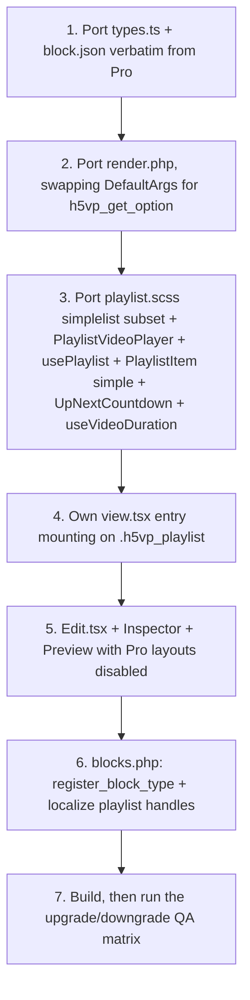

# HTML5 Video Player — Playlist Feature Implementation Plan (Free Version)

> **Revision note (2026-08-19):** this plan was verified against the shipping Pro
> implementation in `html5-video-player-pro/src/blocks/playlist/`. The original
> attribute schema in §2 did **not** match Pro on a single field name and would have
> silently destroyed every free-built playlist on upgrade. §2 below is now copied
> verbatim from Pro and is **the contract** — it is not open to redesign.

---

## 1. Executive Summary

This document outlines the architecture and implementation plan for introducing the
**Video Playlist** Gutenberg block to the **Free version** of the **HTML5 Video Player**
plugin.

The free implementation provides the **Simple List** layout only, while storing its data
in **byte-for-byte the same attribute schema as Pro**. Free and Pro share the Freemius
slug `html5-video-player` (free `is_premium: false`; Pro declares
`premium_slug: html5-video-player-pro`), so upgrading **replaces** the free plugin with
Pro in place — post content is never rewritten, and the block name `html5-player/playlist`
is identical in both. Pro therefore loads free-authored playlists directly out of the
existing post content.

That is only safe if the saved attributes match. WordPress **silently discards** any
attribute a block type does not declare — `WP_Block_Type::prepare_attributes_for_render()`
on the server and `getBlockAttributes()` in the editor both filter against the registered
schema. A misnamed attribute produces **no error and no invalid-block warning**; the value
simply disappears. Schema parity is therefore the single most important requirement of
this feature, in both directions:

* **free → Pro** (upgrade): everything the user built must keep working untouched.
* **Pro → free** (license lapse, refund, manual downgrade — Freemius serves the free build
  again): Pro-only settings must survive being re-saved under free.

---

## 2. Compatibility Contract (copied from Pro — do not deviate)

### 2.1 Block Metadata

| Field | Value |
| :--- | :--- |
| `name` | `html5-player/playlist` |
| `title` | `HTML5 Video Player Playlist` |
| `description` | `Build a video playlist with multiple videos, layouts, search and autoplay.` |
| `category` | `media` |
| `icon` | `playlist-video` |
| `apiVersion` | `3` |
| `keywords` | `["HTML5 Video Player", "Playlist", "Video"]` |
| `textdomain` | **`html5-video-player`** (free domain — Pro uses `h5vp`; this is the one field that intentionally differs, and it affects no stored data) |
| `supports` | `{ "html": false, "lock": false, "reusable": false }` — copy verbatim. **Do not add `align`**; Pro does not declare it, so an `align` value saved in free would be stripped on upgrade and the layout would shift. |

Reference: `html5-video-player-pro/src/blocks/playlist/block.json`.

### 2.2 Saved Block Attributes (`block.json`)

Free must declare **all** of these — including the ones it does not expose in the UI —
otherwise Pro-authored values are stripped the first time the block is re-saved under free.

| Attribute | Type | Default | Exposed in free UI? |
| :--- | :--- | :--- | :--- |
| `uniqueId` | `string` | *(none)* | no — generated |
| `videos` | `array` | `[]` | **yes** |
| `playlistType` | `string` | `"simplelist"` | no — declared only; free always renders Simple List and never writes this key |
| `autoplayNextVideo` | `boolean` | `true` | **yes** |
| `showPrevNext` | `boolean` | `false` | no — declared only, to preserve on downgrade |
| `showSearch` | `boolean` | `false` | no — declared only, to preserve on downgrade |
| `controls` | `array` | `["play-large","play","progress","current-time","mute","volume","captions","settings","fullscreen"]` | no — declared only; free ships the default set |
| `brandColor` | `string` | `"#00B3FF"` | no — see §2.5 |
| `playerWidth` | `string` | `"100%"` | **yes** |

Valid `playlistType` values — **exact slugs, no underscores**:
`simplelist` · `listwithposter` · `rightside` · `grid`

`uniqueId` must use Pro's format, because it is emitted as a CSS class inside a `<style>`
selector by `render.php`:

```ts
`h5vp_playlist_${clientId.replace(/-/g, "").slice(0, 12)}`
```

### 2.3 Video Item Model (`videos[]`)

Reference: `html5-video-player-pro/src/blocks/playlist/types.ts`.

```ts
export type PlaylistProvider = "library" | "youtube" | "vimeo";

export interface PlaylistVideo {
  h5vp_video_provider: PlaylistProvider; // "library" | "youtube" | "vimeo"
  video_source: string;                  // Library / CDN file URL (mp4, m3u8)
  h5vp_video_source: string;             // YouTube / Vimeo URL — SEPARATE field
  video_thumb: string;                   // Poster / thumbnail URL
  video_title: string;
  video_desc: string;
}

export const EMPTY_VIDEO: PlaylistVideo = {
  h5vp_video_provider: "library",
  video_source: "",
  h5vp_video_source: "",
  video_thumb: "",
  video_title: "",
  video_desc: "",
};
```

Two points that are easy to get wrong:

1. **The two source fields are not interchangeable.** `PlaylistVideoPlayer.tsx` resolves
   `isLibrary ? video_source : h5vp_video_source`. Collapsing them into one field breaks
   YouTube and Vimeo playback after upgrade.
2. **There is no `id` and no `duration` field.** Duration is *derived* at runtime by
   `useVideoDuration(video.video_source, provider)`, which probes a detached
   `<video preload="metadata">` and caches by URL (library sources only; YouTube/Vimeo
   yield an empty badge). Free must derive it the same way — a stored `duration` string
   would be discarded on upgrade and the badges would change.

### 2.4 Runtime Payload ≠ Saved Attributes

The original plan conflated these two. The **saved attributes** are flat (§2.2). The
**runtime JSON payload** that `render.php` hands to the frontend React app is nested, and
several of its keys are synthesised server-side and are *not* stored anywhere:

```php
$h5vp_data = array(
    'uniqueId'     => $unique_id,
    'playlistType' => $attributes['playlistType'] ?? 'simplelist',
    'options'      => array(
        'controls'          => $attributes['controls'] ?? $default_controls,
        'muted'             => false,   // synthesised — not an attribute
        'seekTime'          => 10,      // synthesised — not an attribute
        'hideControls'      => true,    // synthesised — not an attribute
        'resetOnEnd'        => true,    // synthesised — not an attribute
        'autoplayNextVideo' => (bool) ($attributes['autoplayNextVideo'] ?? true),
        'showPrevNext'      => (bool) ($attributes['showPrevNext'] ?? false),
        'showSearch'        => (bool) ($attributes['showSearch'] ?? false),
    ),
    'videos'       => $videos,
    'styles'       => array(
        'h5vp_playlist_container' => array(
            'width'     => $attributes['playerWidth'] ?: '100%',
            'max-width' => '100%',
        ),
    ),
);
```

Free's `render.php` must build **this same payload** so the frontend component tree is a
straight port. Free must **not** store `options` or `styles` as block attributes.

### 2.5 Explicitly Forbidden in Free

| Do not | Why |
| :--- | :--- |
| Store `options.{autoplay, muted, hideControls, resetOnEnd, ratio}` or `styles` as attributes | Pro does not declare them; they are stripped on upgrade, so any playback behaviour keyed to them changes silently |
| Store a per-item `duration` | Derived at runtime in Pro (§2.3) |
| Store `id` on items | Not in Pro's model; use the array index (Pro keys everything off the *original* index) |
| Expose a per-block brand colour control | Pro's `render.php` **ignores** the `brandColor` attribute and uses the global `h5vp_player_primary_color` via `DefaultArgs::brandColor()`. A per-block colour honoured by free would visibly change on upgrade. Declare the attribute for schema parity, drive the CSS variables from the global option only. |
| Rename or "improve" any attribute or slug | Every rename is silent data loss in at least one direction |
| Add `supports.align` or other extra supports | Stripped on upgrade (§2.1) |

### 2.6 Upgrade / Downgrade Behaviour Matrix

| Scenario | Expected result |
| :--- | :--- |
| free → Pro, simple-list playlist | Renders identically; all videos, titles, descriptions, thumbnails, controls and autoplay setting intact |
| free → Pro, then user picks `grid` | Works; free never wrote a conflicting value |
| Pro → free, `playlistType` is `grid` / `rightside` / `listwithposter` | Frontend falls back to Simple List. The **stored value is not overwritten**: free declares the attribute but exposes no layout control, so nothing in free can write it and the value round-trips when the license is restored |
| Pro → free, `showSearch` / `showPrevNext` are `true` | Values preserved (declared but unexposed); free's frontend simply ignores them |
| Pro → free, `.mpd` (DASH) source | Free has no dash.js. Item does not play; do not crash the playlist. Free's provider help text must say `mp4 / m3u8` only |
| Both plugins active at once (manual Pro install over free) | Already safe — the `function_exists('h5vp_fs')` guard at `html5-video-player.php:22` short-circuits the second plugin before `includes.php`/`blocks.php` load, so there is no duplicate `register_block_type()` and no class redeclaration |

---

## 3. UI/UX Design Specifications

### 3.1 Gutenberg Inspector Controls (Sidebar)

Mirrors Pro's `components/Inspector.tsx` panel order so the sidebar looks unchanged after
upgrade.

```
┌─────────────────────────────────────────────────────────┐
│ ▼ Videos (5)                                            │
│  ┌───────────────────────────────────────────────────┐  │
│  │ ::: Video 1                     [Copy] [✕]        │  │
│  ├───────────────────────────────────────────────────┤  │
│  │ Provider:      [ Library / CDN              ▼ ]   │  │
│  │ Video Source:  [ …/video.mp4        ] [ ⇪ ]       │  │ ← video_source (library)
│  │   —or—                                            │  │
│  │ YouTube / Vimeo URL: [ https://…            ]     │  │ ← h5vp_video_source
│  │ Thumbnail:     [ …/thumb.jpg        ] [ ⇪ ]       │  │ ← video_thumb
│  │ Title:         [ View From A Blue Moon…     ]     │  │ ← video_title
│  │ Description:   [ See the sport of surfing…  ]     │  │ ← video_desc
│  └───────────────────────────────────────────────────┘  │
│  [ + Add Video ]                                        │
├─────────────────────────────────────────────────────────┤
│ ▶ Playlist Settings                                     │
│    [x] Auto Play Next Video                             │
│    Player Width: [ 100% ]                               │
└─────────────────────────────────────────────────────────┘
```

> **Scope note (2026-08-19):** an earlier draft of this section also specified a
> **Layout** select (Simple List plus the three Pro layouts shown disabled) and a
> **Player Controls** panel of 16 toggles. Neither ships in free, and neither is
> needed for data safety: `playlistType`, `controls`, `showSearch` and `showPrevNext`
> are all declared in `block.json` (§2.2), so a Pro-authored value round-trips through
> free untouched — free simply never writes them. Free's frontend falls back to Simple
> List for any non-`simplelist` value and renders the default control set. Verified by
> saving a Pro `grid` playlist with search enabled, downgrading, and confirming every
> Pro-only key survives in `post_content`.

Implementation notes:

* The repeater is `bpl-tools/Components/ItemsPanel/ItemsPanel` with `design="sortable"` —
  the same component Pro uses, which gives drag reordering, duplicate and delete for free.
  It is already available to this plugin (`src/blocks/blocks.ts` imports
  `bpl-tools/Components/style.scss`).
* Media pickers are `bpl-tools/Components/MediaControl/MediaControl` → `InlineMediaUpload`.
* The provider select swaps which source field is rendered: `library` → `InlineMediaUpload`
  bound to `video_source`; `youtube`/`vimeo` → `TextControl` bound to `h5vp_video_source`.
* Should a `controls` picker ever be added to free, its toggles must preserve Pro's
  canonical button order when re-adding a key (Pro filters the master `CONTROL_OPTIONS`
  list rather than appending), so Plyr's control bar does not reshuffle after upgrade.

### 3.2 Canvas & Frontend Layout (Simple List)

```
┌─────────────────────────────────────────────────────────────────┐
│                      [ ▶ Main Video Player ]                    │
├─────────────────────────────────────────────────────────────────┤
│  (▮▮) View From A Blue Moon - Official Trailer   ≋       3:03    │ ← active + playing
│  ( ▶) How to Create a Custom Video Player                       │ ← active, paused
│   ▷   Autoplay, Sticky Player & Custom Play Button              │
│   ▷   Big Buck Bunny                                    0:30    │
└─────────────────────────────────────────────────────────────────┘
```

Markup and class names are ported from Pro's `PlaylistItem.tsx` (`variant="simple"`) so the
stylesheet subset can be lifted directly:

```html
<div id="{uniqueId}" class="video video--bg simplelist">
  <div class="h5vp_playlist_container playlist_loaded">
    <div class="video__top video__wrapper"><!-- Plyr player --></div>
    <ul class="video__top h5vp_playlist_items" role="listbox" tabindex="0">
      <li data-index="0" data-provider="library" data-source="">
        <div class="svg play_pause_svg" role="button">…</div>
        <div class="video_title"><span class="title">…</span></div>
        <span class="h5vp_playlist_badge__bars h5vp_pl_simple_eq"><i/><i/><i/></span>
        <span class="h5vp_playlist_badge h5vp_playlist_badge--duration">3:03</span>
      </li>
    </ul>
  </div>
</div>
```

Behaviour, ported from `usePlaylist.ts` so it matches Pro exactly:

1. **Click** a row → `select(originalIndex)`, player source swaps, playback starts.
2. **Autoplay next** → on `ended`, if `options.autoplayNextVideo`, show the **5-second
   "Up next" countdown** (`UpNextCountdown`, `COUNTDOWN_SECONDS = 5`) with Cancel / Play now,
   then advance. Do not auto-advance instantly — that would be a visible behaviour change
   on upgrade.
3. **Keyboard** listbox semantics: ↑/↓/←/→, Home, End, Enter/Space to toggle play.
4. All state is keyed to each video's **original index** so future search/filtering cannot
   desync playback.

---

## 4. Implementation Steps



### 4.1 File Changes

| Status | File Path | Description |
| :--- | :--- | :--- |
| **NEW** | `src/blocks/playlist/block.json` | Schema from §2.2, verbatim. `editorScript: file:./index.js`, `editorStyle: file:./index.css`, `viewScript: file:./view.js`, `style: file:./view.css`, `render: file:./render.php` |
| **NEW** | `src/blocks/playlist/index.ts` | `registerBlockType(metadata, { edit, save: () => null })` |
| **NEW** | `src/blocks/playlist/types.ts` | `PlaylistVideo`, `PlaylistBlockAttributes`, `EMPTY_VIDEO` — port from Pro |
| **NEW** | `src/blocks/playlist/Edit.tsx` | `uniqueId` generation, empty-state `Placeholder`, `<Inspector>` + `<Preview>` |
| **NEW** | `src/blocks/playlist/components/Inspector.tsx` | Panels per §3.1 |
| **NEW** | `src/blocks/playlist/components/VideoItemSettings.tsx` | Per-item fields, provider-conditional source field |
| **NEW** | `src/blocks/playlist/components/Preview.tsx` | Static, no-Plyr canvas preview reusing the frontend classes |
| **NEW** | `src/blocks/playlist/view.tsx` | Frontend entry; mounts on `.h5vp_playlist` (see §4.2) |
| **NEW** | `src/blocks/playlist/render.php` | Emits the §2.4 payload on an **inner** `.h5vp_playlist` div |
| **NEW** | `src/blocks/playlist/editor.scss` | Editor-only chrome |
| **NEW** | `src/blocks/Components/Common/PlaylistVideoPlayer.tsx` | Plyr wrapper; resolves `video_source` vs `h5vp_video_source` by provider |
| **NEW** | `src/blocks/Components/Common/playlist/PlaylistSimple.tsx` | Simple List layout |
| **NEW** | `src/blocks/Components/Common/playlist/PlaylistItem.tsx` | `variant="simple"` branch only |
| **NEW** | `src/blocks/Components/Common/playlist/usePlaylist.ts` | Shared state hook (port whole file; unused branches are harmless and keep future porting a no-op) |
| **NEW** | `src/blocks/Components/Common/playlist/UpNextCountdown.tsx` | 5s auto-advance countdown |
| **NEW** | `src/blocks/Components/Common/playlist/useVideoDuration.ts` | Runtime duration probe — port verbatim, it is self-contained |
| **NEW** | `src/playlist.scss` | `simplelist` subset of Pro's `src/playlist.scss` (same path as Pro, so future diffs apply cleanly) |
| **MODIFY** | `blocks.php` | `register_block_type(H5VP_PLUGIN_PATH . 'build/blocks/playlist')` + localization (§4.4) |
| **DO NOT TOUCH** | `src/blocks/blocks.ts` | See §4.3 — adding an import here double-registers the block |
| **DO NOT TOUCH** | `src/blocks/view.tsx` | See §4.2 — the shared view bundle must never see the playlist payload |
| **DO NOT TOUCH** | `src/blocks/types.ts` | Playlist types live in `src/blocks/playlist/types.ts`, matching Pro |

### 4.2 Mount contract — the shared `view.js` collision

`src/blocks/view.tsx:12-17` mounts the **single-video** `VideoPlayer` into *any* element
matching `[class^="wp-block-html5-player-"]` that carries `data-attributes` — and unlike
Pro's copy it does not even require `data-nonce`, so it is *more* eager. `h5vp-view` is
loaded by the video block's `viewScript`, so on any page containing both a video block and
a playlist block the playlist payload would be fed to `VideoPlayer` and blow up.

Pro avoids this structurally, and free must do the same: the outer
`get_block_wrapper_attributes()` div (class `wp-block-html5-player-playlist`) carries **no
`data-attributes`**; the payload goes on an **inner** `.h5vp_playlist` div, which the shared
selector never matches.

```php
<div <?php echo wp_kses_data( get_block_wrapper_attributes() ); ?>>
    <style>
        .h5vp_playlist.<?php echo esc_attr( $h5vp_unique_id ); ?>,
        .h5vp_playlist.<?php echo esc_attr( $h5vp_unique_id ); ?> .plyr {
            --h5vp-accent: <?php echo esc_attr( $h5vp_brand_color ); ?>;
            --plyr-color-main: <?php echo esc_attr( $h5vp_brand_color ); ?>;
        }
    </style>
    <div class="h5vp_playlist <?php echo esc_attr( $h5vp_unique_id ); ?>"
        data-attributes="<?php echo esc_attr( wp_json_encode( $h5vp_data ) ); ?>"
        data-nonce="<?php echo esc_attr( wp_create_nonce( 'wp_ajax' ) ); ?>"></div>
</div>
```

`src/blocks/playlist/view.tsx` then mounts on `.h5vp_playlist`, guarding against a duplicate
React root with a `data-h5vp-mounted` flag (Pro's `frontend-playlist.tsx` does this because
`DOMContentLoaded` and Elementor's `element_ready` can both fire). Include
`import { version } from "react-dom";` so `react-dom` lands in `view.asset.php` — the same
reason documented at `src/blocks/view.tsx:2`.

> Note: `src/blocks/audio/render.php` puts `data-attributes` on its own
> `wp-block-html5-player-audio` wrapper and so has this same latent exposure today. Out of
> scope here, but worth a follow-up ticket.

### 4.3 Registration — exactly one path

The block registers itself through `block.json`'s `editorScript` (the audio-block pattern,
and Pro's playlist pattern — note Pro's `src/blocks/blocks.ts` deliberately does *not*
import playlist). Adding an import to `src/blocks/blocks.ts` **as well** would call
`registerBlockType('html5-player/playlist')` twice and throw
*"Block html5-player/playlist is already registered"*. Pick the `block.json` path only.

`wp-scripts` auto-discovers `src/blocks/playlist/block.json` and emits
`build/blocks/playlist/`; `--webpack-copy-php` copies `render.php`. The existing `zip`
script already includes `build`, so no packaging change is needed.

### 4.4 PHP wiring

1. `blocks.php` → `register_block()`: add
   `register_block_type( H5VP_PLUGIN_PATH . 'build/blocks/playlist' );`
2. **Brand colour:** free has **no** `\H5VP\Helper\DefaultArgs` class — copying Pro's
   `render.php` verbatim is a fatal error. Use the free idiom already in `blocks.php:44`:
   ```php
   $get_option = h5vp_get_option();
   $h5vp_brand_color = $get_option( 'h5vp_player_primary_color', '#00b2ff' );
   ```
3. **Localization:** the playlist has its own auto-generated script handles, so the
   `h5vpBlock` object attached to `h5vp-blocks` / `h5vp-view` will **not** reach it — the
   exact bug that forced `localize_audio_block()` (`blocks.php:69-85`). Add the same
   treatment for `html5-player/playlist`, over both `editorScript` and `viewScript`, passing
   at minimum `brandColor` and the Plyr `iconUrl` (`H5VP_PLUGIN_DIR . 'img/plyr.svg'`) —
   without `iconUrl` Plyr's icon controls render invisible.
4. **Streaming:** loop the videos and `wp_enqueue_script('bplugins-hls')` when any
   `video_source` contains `.m3u8`. Free ships no dash.js, so `.mpd` is unsupported —
   reflect that in the field placeholder and skip the enqueue rather than referencing a
   non-existent handle.
5. **Filter parity:** wrap the attributes in
   `apply_filters( 'h5vp_playlist_block_attributes', $attributes )`, the same hook name Pro
   uses, so third-party code behaves identically across versions.
6. Bail early (`return;`) when `videos` is empty, matching Pro.

---

## 5. Free vs Pro Feature Distinction

| Feature | Free | Pro |
| :--- | :---: | :---: |
| Simple List layout | ✅ | ✅ |
| Autoplay next (with 5s "Up next" countdown) | ✅ | ✅ |
| Providers: Library/CDN, YouTube, Vimeo | ✅ | ✅ |
| HLS (`.m3u8`) | ✅ | ✅ |
| DASH (`.mpd`) | ❌ | ✅ |
| Unlimited videos per playlist | ✅ | ✅ |
| Drag reordering / duplicate / delete | ✅ | ✅ |
| Player controls selection | ❌ | ✅ |
| Player width | ✅ | ✅ |
| List With Thumb layout | ❌ | ✅ |
| List on Right Side layout | ❌ | ✅ |
| Grid / Gallery layout | ❌ | ✅ |
| Live search filter | ❌ | ✅ |
| Prev / Next overlay arrows | ❌ | ✅ |
| Playlist CPT + `[video_playlist]` shortcode | ❌ | ✅ |

Free currently has **zero** playlist code (`grep -ri playlist inc src` is clean), so there
is no legacy data to migrate. Pro's playlist CPT and shortcode are premium-only and are
unaffected by this block.

*Business note:* if the free video count is ever capped, remember the cap only bites on
downgrade — capped free + a Pro-authored 20-item playlist must still render all 20 rather
than truncate stored data.

---

## 6. Verification & QA

### 6.1 Editor
1. Insert **HTML5 Video Player Playlist**; confirm the empty-state placeholder.
2. Add items for all three providers; confirm the source field swaps with the provider and
   writes to `video_source` vs `h5vp_video_source`.
3. Drag-reorder, duplicate, delete; confirm the canvas preview tracks the changes.
4. Confirm there is no layout or player-controls UI (free ships neither — see §3.1).
5. Open the code editor (`⌥⇧⌘M`) and read the block comment JSON — assert **every** key
   name matches §2.2/§2.3 exactly. This is the cheapest possible guard against the original
   plan's failure mode.

### 6.2 Frontend
1. Publish and verify playback, poster, and the selected control set.
2. Click rows → source swaps and plays; active/playing states and the equaliser badge update.
3. Let a video end → 5s countdown → next video; Cancel and Play-now both work.
4. Duration badges appear for library sources and are absent (not `0:00`) for YouTube/Vimeo.
5. Keyboard: ↑/↓/Home/End/Enter on the list.
6. **Collision test:** a page containing a video block **and** a playlist block — confirm
   no console error and that neither player hijacks the other's container. Repeat with an
   audio block on the same page.
7. A page containing **only** a playlist block — confirm `view.js`/`view.css` still load
   (this is what `viewScript`/`style` in `block.json` buys us).
8. Elementor page containing a playlist — confirm a single React root (no double mount).

### 6.3 Upgrade / downgrade (the point of this plan)
1. Build a 5-item playlist in free covering all three providers, custom title/description/
   thumbnail per item, autoplay-next **off**, a non-default control set, `playerWidth: 800px`.
   Publish. Save the post's `post_content` for diffing.
2. Activate Pro (Freemius replace flow). **Without editing anything**, load the front end:
   all five videos play, titles/descriptions/thumbnails intact, autoplay-next still off,
   control set preserved, width preserved.
3. Open the post in the editor under Pro: the inspector is fully populated; `post_content`
   is unchanged until deliberately edited.
4. Switch the layout to `grid` under Pro, save. Revert to free: the front end falls back to
   Simple List, and re-saving the post in free **keeps** `playlistType: "grid"`,
   `showSearch`, and `showPrevNext` in `post_content`.
5. Re-activate Pro: the grid layout and search bar return without re-configuration.

### 6.4 Responsive
Touch-target size and row legibility at mobile and tablet widths.
